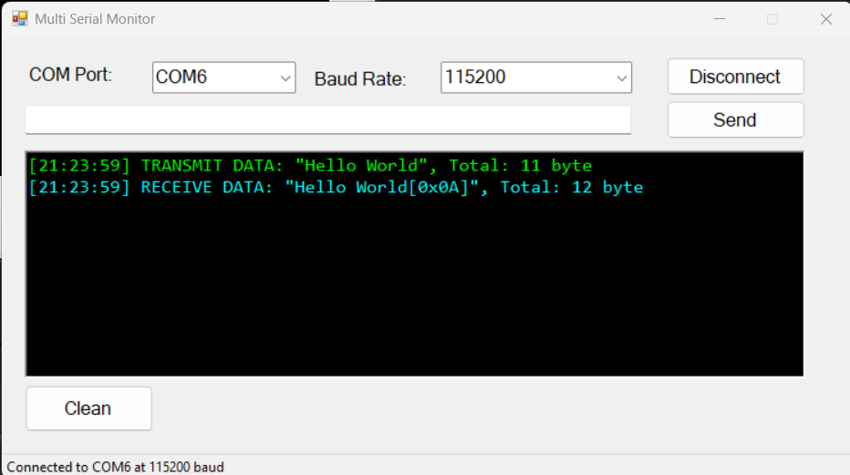

# MultiSerialMonitor

MultiSerialMonitor is a simple Windows Forms application built in C# for monitoring and interacting with serial COM ports. It allows users to connect to available serial ports, send data, and view incoming data with timestamps and byte counts in a user-friendly interface.

## Features

- Detect and list all available COM ports dynamically.
- Automatically refresh the port list when the user opens the port selection dropdown.
- Connect and disconnect from selected serial ports with specified baud rates.
- Send data via serial port using a textbox and Send button or pressing Enter.
- Receive data asynchronously, buffering and displaying with timestamps and visible control characters.
- Logs both sent and received data with color-coded entries.
- Clear the log display anytime.
- Fixed window size with intuitive controls.

## Usage

1. Select the desired COM port from the dropdown.
2. Choose the baud rate.
3. Click **Connect** to open the serial port.
4. Type your message into the textbox and press **Send** or hit **Enter** to transmit.
5. Incoming data will be displayed with timestamps and highlighted for easy reading.
6. Use the **Clear** button to reset the log.

## Requirements

- Windows OS
- .NET Framework (version compatible with Windows Forms)
- Serial device connected to the computer

## Tests

  

This is general view on 06/06/2025

## License

This project is open-source and free to use for educational and personal projects.

Created with ❤️ by [Semi Eren Gökyıldız]
